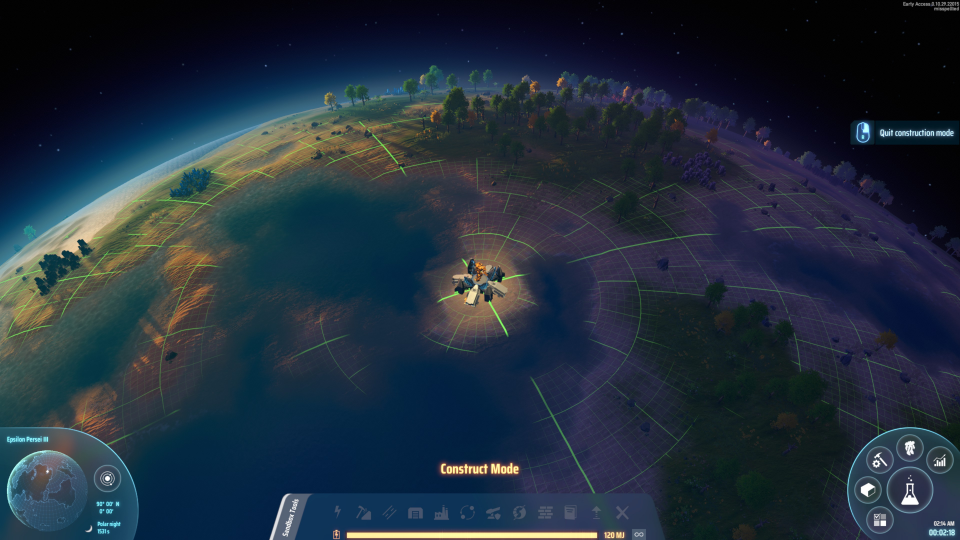

# Systems

## Epsilon Persei (Starting)

### Star

|Details||
|-|-|
|Spectral Type|G|
|Mass|0.939 M &#9737;|
|Radius|0.88 R &#9737;|
|Luminosity|0.986 L &#9737;|
|Temperature|5,557 K|
|Age|6,267 Myrs|

|Planets|
|-|
|[I](#i)
|[II](#ii)
|[III](#iii-landing)
|[IV](#iv)

### I

|Details||
|-|-|
|Type|Lava|
|Orbits|[Star](#star)|
|Orbit Radius|0.387 AU|
|Revolution Period|1,341 sec|
|Rotation Period|335 sec|
|Orbit Inclination|6&deg;58'|
|Longitude of (AN)|253&deg;1'|
|Planet Obliquity|0&deg;26'|

|Features||
|-|-|
|Satellites|None|
|Horizontal Rotation|No|
|Orbital Resonance|<feature>1:4</feature>|

|Construction||
|-|-|
|Building Area|87.7%|
|Wind Energy Ratio|70%|
|Solar Energy Ratio|133%|

|Resources (x1)||
|-|-|
|Iron Ore|18,627,754|
|Copper Ore|20,332,390|
|Silicon Ore|565,361|
|Titanium Ore|10,687,446|
|Stone|1,284,673|
|Coal|135,493|
|Ocean Type|Lava|
|Crude Oil|None|
|Fire Ice|None|

### II

|Details||
|-|-|
|Type|Ice Giant|
|Orbits|[Star](#star)|
|Orbit Radius|0.971 AU|
|Revolution Period|5,332 sec|
|Rotation Period|215 sec|
|Orbit Inclination|3&deg;44'|
|Longitude of (AN)|223&deg;14'|
|Planet Obliquity|-79&deg;12'|

|Features||
|-|-|
|Satellites|[III](#iii-landing)|
|Horizontal Rotation|<feature>Yes</feature>|
|Orbital Resonance|No|

|Resources|(x1)|
|-|-|
|Fire Ice|? / sec|
|Hydrogen|? / sec|

### III (Landing)

As the starting planet, Icarus will land at 90&deg;00', 0&deg;00' - the North Pole! Note that the raised landing platform is not possible with normal reclamation foundation placements.

Additionally, there are no starting copper ore or iron ore veins present.

|Details||
|-|-|
|Type|Mariterra|
|Orbits|[II](#ii)|
|Orbit Radius|0.064 AU|
|Revolution Period|988 sec|
|Rotation Period|527 sec|
|Orbit Inclination|5&deg;7'|
|Longitude of (AN)|326&deg;36'|
|Planet Obliquity|7&deg;35'|

|Features||
|-|-|
|Satellites|None|
|Horizontal Rotation|No|
|Orbital Resonance|No|

|Construction||
|-|-|
|Building Area|62.1%|
|Wind Energy Ratio|100%|
|Solar Energy Ratio|94%|

|Resources|(x1)|
|-|-|
|Iron Ore|2,972,743|
|Copper Ore|1,406,758|
|Silicon Ore|None|
|Titanium Ore|None|
|Stone|4,969,914|
|Coal|10,454,182|
|Ocean Type|Water|
|Crude Oil|49.04 / sec|
|Fire Ice|None|

### IV

|Details||
|-|-|
|Type|Icefrostia|
|Orbits|[Star](#star)|
|Orbit Radius|1.837 AU|
|Revolution Period|13,873 sec|
|Rotation Period|639 sec|
|Orbit Inclination|6&deg;14'|
|Longitude of (AN)|257&deg;25'|
|Planet Obliquity|19&deg;50'|

|Features||
|-|-|
|Satellites|None|
|Horizontal Rotation|No|
|Orbital Resonance|No|

|Construction||
|-|-|
|Building Area|100.0%|
|Wind Energy Ratio|130%|
|Solar Energy Ratio|64%|

|Resources|(x1)|
|-|-|
|Iron Ore|8,992,624|
|Copper Ore|668,823|
|Silicon Ore|1,288,654|
|Titanium Ore|6,753,819|
|Stone|935,450|
|Coal|106,904|
|Ocean Type|None|
|Crude Oil|None|
|Fire Ice|None|
